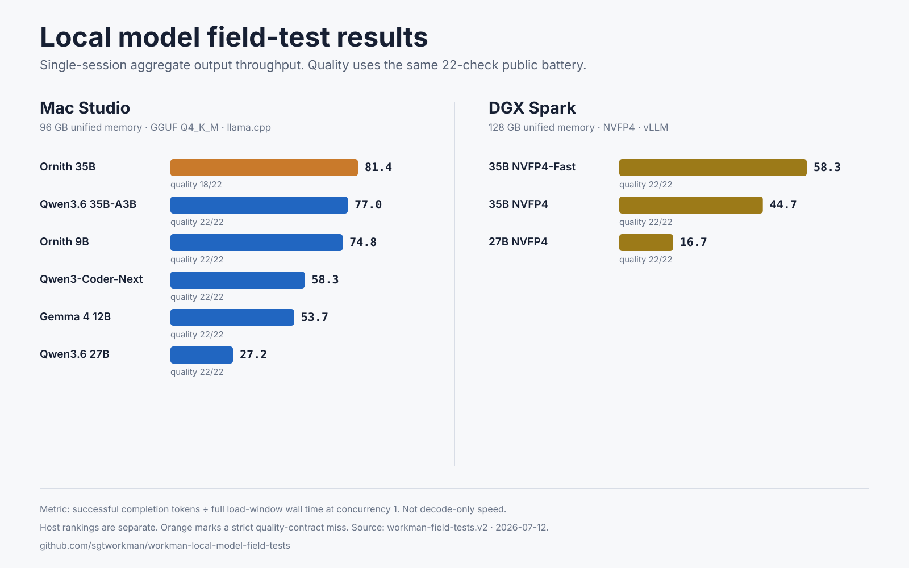
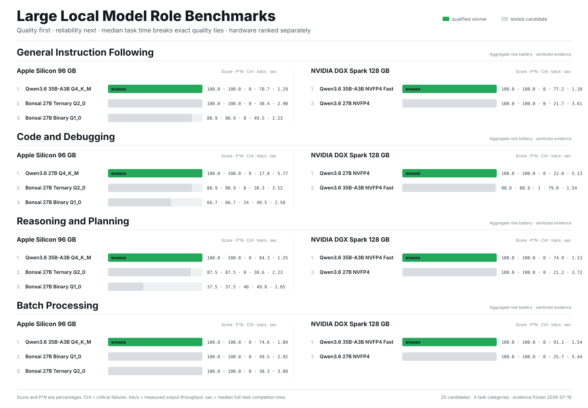
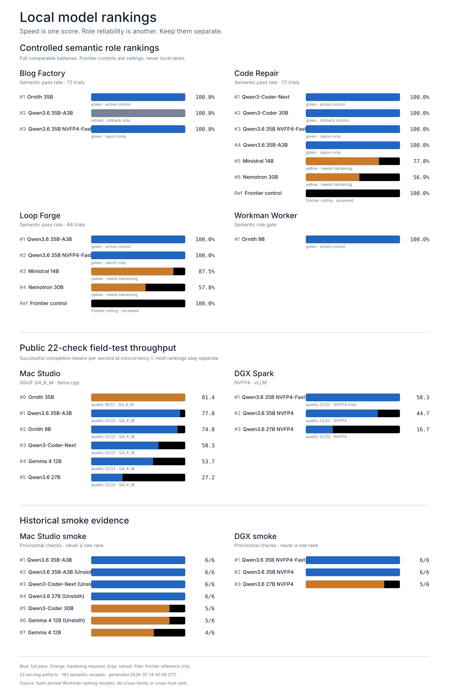

# Workman Local Model Field Tests

Fast is easy to post. Reliable is harder.

This repository tests both.

Run the same public battery against local models on DGX Spark, Apple Silicon, or any OpenAI-compatible endpoint. Measure instruction following, structured output, tool shape, code repair, safety gates, context retention, latency, and request-level output throughput.

Publish the conditions. Keep the failures. Let other operators reproduce the result.

## Verified public-battery results

The committed [nine-model evidence pack](results/verified/2026-07-12-nine-model-v2/) contains admitted v2 quality artifacts and separate streaming-load records for six Mac Studio GGUF artifacts and three DGX Spark NVFP4 artifacts.



Eight artifacts passed 22/22 with zero request errors and zero reasoning leaks. Ornith 35B passed 18/22 because it violated strict output contracts. Speed rankings remain host-specific; Mac and DGX throughput are not combined.

| Host | Quality-first selection | Serving format | Quality | Evidence |
|---|---|---|---:|---|
| 96 GB Mac Studio | Qwen3.6 35B-A3B | GGUF Q4_K_M / llama.cpp | 22/22 | [Mac ranking and artifacts](results/verified/2026-07-12-nine-model-v2/#mac-studio-streaming-results) |
| 128 GB DGX Spark | Qwen3.6 35B-A3B NVFP4-Fast | NVFP4 / vLLM | 22/22 | [DGX ranking and artifacts](results/verified/2026-07-12-nine-model-v2/#dgx-spark-streaming-results) |

The v1 artifact's field named `generation_tokens_per_second` measures completion tokens divided by full request wall time. That includes connection, queueing, prefill, and decode. It is retained for historical transparency and must not be interpreted as decode speed.

The older top-level DGX and multi-model files under `results/` are historical operator records. They remain excluded from the admitted leaderboard so the original claims are not silently erased or mixed with v2 evidence.

Community result admission requires a `workman-field-tests.v2` artifact that passes provenance, comparability, and privacy validation. Cross-model ranking is allowed only within the same admitted public-battery comparability class. Cross-hardware speed ranking is not supported.

Admission also reconciles every raw `(scenario_id, repeat)` identity against row counts and summary totals. Duplicate temperature-zero rows cannot inflate quality.

See the [2026-07-11 adversarial audit remediation](docs/AUDIT_REMEDIATION_2026-07-11.md) for the corrected claims and remaining holds.

## Current category rankings

The [2026-07-19 category release](results/verified/2026-07-19-category-rankings/) compares large local models across General Instruction Following, Code and Debugging, Reasoning and Planning, and Batch Processing.



Every panel is ranked independently by hardware. Quality comes first, then Pass^N reliability and critical failures; median task completion time breaks exact quality ties. A faster model does not win by outrunning a quality deficit.

The release contains sanitized aggregates only. Private fixtures, internal task names, active assignments, routes, and machine identities are not published. The separate [winner-assignment policy](docs/WINNER_ASSIGNMENT_POLICY.md) explains how a measured winner becomes a controlled live assignment without confusing “tested,” “qualified,” “assigned,” and “live.”

## Operator role rankings

The [2026-07-13 role-ranking update](results/verified/2026-07-13-role-rankings/) publishes sanitized aggregate results for four governed operator roles: Structured Publishing, Code Repair, Workflow Orchestration, and General Operations.



These are not replacements for the public 22-check battery. Role batteries use private operational fixtures, so only aggregate scores, trial counts, statuses, and receipt hashes are public. Frontier controls remain unranked reference ceilings. Public throughput, role reliability, historical smoke evidence, and different hardware classes are deliberately kept separate.

Qwen3.6 35B-A3B NVFP4-Fast passed all 208 role trials and repeated 208/208 in the first scheduled passive watchdog. It tied the current champions on semantic quality across all three large-model roles. No automatic production promotion was made.

## Run it

Python 3.10 or newer. No runtime dependencies.

```bash
git clone https://github.com/sgtworkman/workman-local-model-field-tests.git
cd workman-local-model-field-tests
python3 -m venv .venv
source .venv/bin/activate
python -m pip install -e .
```

Run the repository verification suite:

```bash
python scripts/verify_release.py
```

Run the 22-check battery against llama.cpp:

```bash
workman-field-test \
  --base-url http://127.0.0.1:8080/v1 \
  --model ornith \
  --hardware "Mac Studio" \
  --runtime "llama.cpp b9821" \
  --quantization Q4_K_M \
  --output raw-results/ornith-35b.json
```

Run it against vLLM on DGX Spark:

```bash
workman-field-test \
  --base-url http://127.0.0.1:8888/v1 \
  --model unsloth/Qwen3.6-35B-A3B-NVFP4 \
  --hardware "NVIDIA DGX Spark 128GB" \
  --runtime "vLLM" \
  --quantization NVFP4 \
  --no-think \
  --output raw-results/qwen36-dgx.json
```

The runner does not write the endpoint URL or API key into the result.

Every completed scenario/repeat is checkpointed with an atomic file replacement. Add `--resume` to continue an interrupted run from completed stable identities; a checkpoint from a different model is rejected.

To create an admission-ready v2 artifact, add `--admission-ready` plus the exact model revision, runtime version, hardware memory, context limit, and OS metadata. Validate it before submission:

```bash
workman-field-admit results/community/your-name/result.json --verify-commit
```

## Streaming and concurrency measurements

The experimental streaming runner separates TTFT, TPOT, end-to-end latency, request throughput, and aggregate output-token throughput:

```bash
workman-field-load \
  --base-url http://127.0.0.1:8888/v1 \
  --model unsloth/Qwen3.6-35B-A3B-NVFP4 \
  --levels 1,2,4,8 \
  --requests-per-worker 2 \
  --no-think \
  --output raw-results/qwen36-load.json
```

Concurrency above 8 requires `--acknowledge-high-load`. The runner requires final server usage counts for token-based metrics; it does not treat SSE chunks as tokens. Use `--request-rate` for an open-loop arrival schedule and inspect dispatch-delay metrics to detect client backlog.

## Sanitize before publishing

```bash
workman-field-sanitize raw-results/qwen36-dgx.json \
  --output results/community/your-name/qwen36-dgx.json
```

The sanitizer is best-effort. It removes known credential-adjacent fields, embedded private addresses, internal hostnames, usernames, and personal paths. It cannot guarantee that arbitrary model output is safe to publish. Review the output yourself. You own the release.

## Compare admitted artifacts

```bash
workman-field-compare results/community/your-name/*.json \
  --output LEADERBOARD.md
```

The comparison is quality-first. Request-level throughput breaks ties only inside a defensible comparability class. Do not combine different hardware/runtime/quantization profiles into one speed ranking.

## What is public

- Generic prompts
- Runner and sanitizer
- Runtime metadata
- Sanitized raw outputs
- Pass/fail results
- Latency and throughput
- Reproduction instructions

## What stays private

- Credentials
- Private network details
- Customer or business data
- Proprietary prompts
- Internal routing policy
- Operational hostnames and filesystem paths

Read [the methodology](docs/METHODOLOGY.md). The [contribution guide](CONTRIBUTING.md) documents the v2 admission boundary.

Speed gets attention. Reproducibility earns trust.
